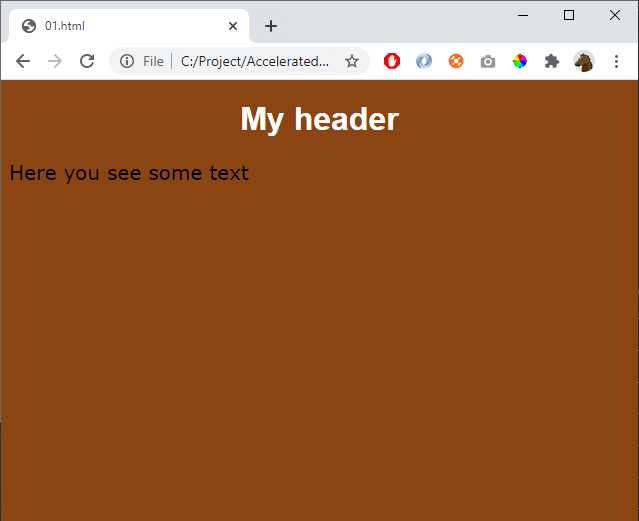

# 01 - Basics

References
- https://www.w3schools.com/css/default.asp
- https://www.w3schools.com/css/css_intro.asp
- https://www.w3schools.com/css/css_syntax.asp 

Hint: 
- color used: saddlebrown, white
- fonts used: Arial, verdana

Create this page:

