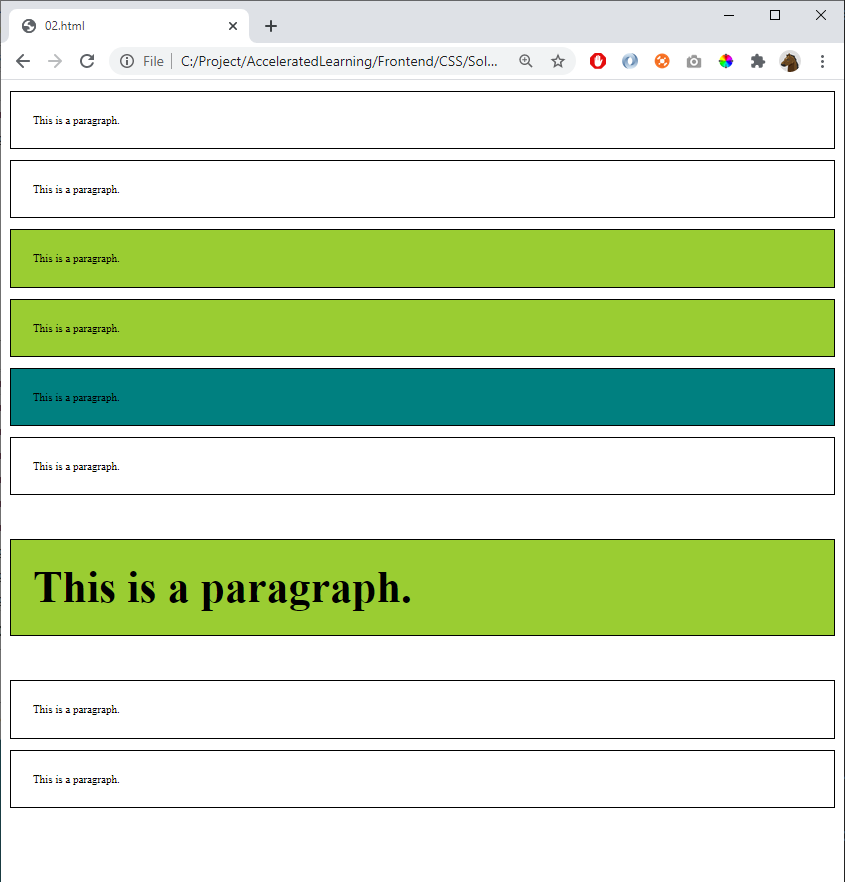

# 02 - Selectors and Comments

References
- https://www.w3schools.com/css/css_selectors.asp 
- https://www.w3schools.com/css/css_howto.asp
- https://www.w3schools.com/css/css_comments.asp

Hint: 
- color used: saddlebrown, white
- fonts used: Arial, verdana

Use this html

    
This is a paragraph.

    
This is a paragraph.

    
This is a paragraph.

    
This is a paragraph.

    
This is a paragraph.

    
This is a paragraph.

    
This is a paragraph.

    
This is a paragraph.

    
This is a paragraph.

...and add CSS to create this page:

