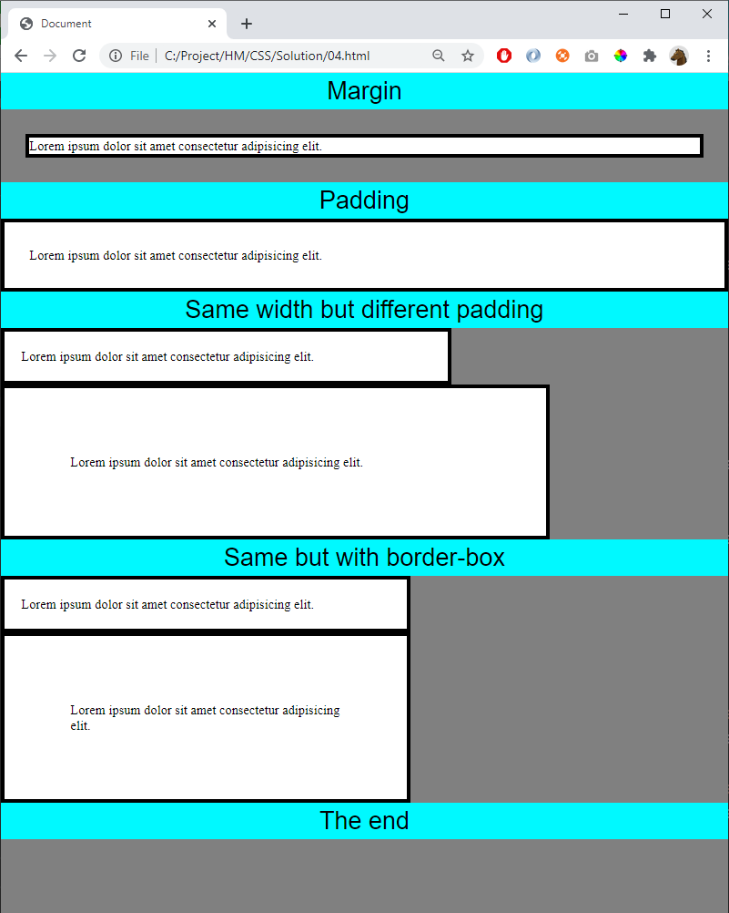

# 04 - Margin and Padding

References
- https://www.w3schools.com/css/css_margin.asp 
- https://www.w3schools.com/css/css_padding.asp
- https://www.w3schools.com/css/css_boxmodel.asp
- https://developer.mozilla.org/en-US/docs/Web/CSS/box-sizing

Hint, start with this styling

    body {
        background: grey;
        margin: 0;
    }

    div {
        border: solid 5px;
        background: white;
        margin: 0;
        padding: 0;
    }

    .divider {
        background-color: #00f9ff;
        border-color: #00f9ff;
        font-size: 30px;
        text-align: center;
        font-family: Arial, Helvetica, sans-serif;
    }

Create this page:

