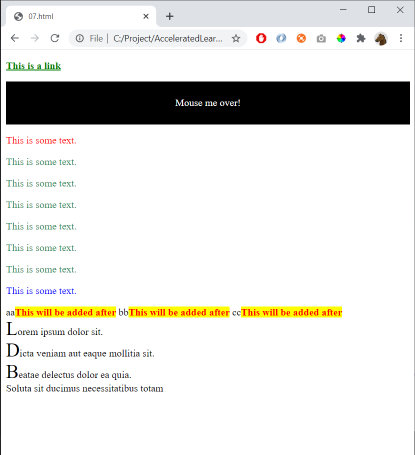

# 07 - Pseudo classes and elements

References
- https://www.w3schools.com/css/css_pseudo_classes.asp 
- https://www.w3schools.com/cssref/sel_after.asp
- https://www.w3schools.com/css/css_pseudo_elements.asp

Try these pseudo classes:

    :link 
    :visited 
    :hover 
    :active 
    :first-child
    :last-child
    :not

Try these pseudo elements:

    ::after
    ::first-letter

Create this page:

