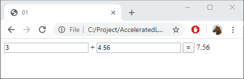

# 01 - Quick and dirty

Create a calculator that adds two numbers:

Create one HTML-file and one Javascript-file

Make the simplest possible solution. Ignore validation and styling.

## Hint

Check out these methods:

    parseFloat

    document.getElementById("......")
    document.getElementById("......").value
    document.getElementById("......").innerText

## Reference

This page:

https://www.w3schools.com/js/js_htmldom.asp

...and the other pages under header "JS HTML DOM"
