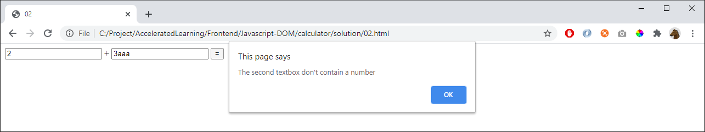

# 02 - Validation and rounding

Try to add 0.1 with 0.2. What happens?

Validate the numbers the user fills in. If the user enters incorrect values, respond by displaying an alert box with info:
- The first textbox don't contain a number
- The second textbox don't contain a number

When displaying the result: round numbers like -0.30000000000000004 to -0.3

## Tips

To display an alertbox:

    alert('hello')

Explore the function "trim":

    myString.trim()

Create these functions:

    // This function should return "true" if "x" is a number. Otherwise "false"
    // (You might need to google to create this function)
    function isNumber(x){

    }

    // Round the number "x"
    function round(x){
    }

    // This function should be called when the user press the button
    function sum() {
    }