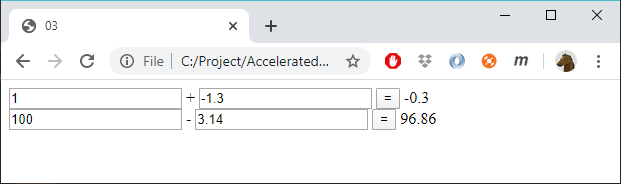

# 03 - Subtraction (quick-n-dirty)

Add the opportunity to subtract numbers:

If the user write a non-digit, give different messages depending on whether it is addition or subtraction:
- The first textbox of the addition don't contain a number
- The first textbox of the subtraction don't contain a number

Do not be afraid of copy-n-paste (quick-and-dirty). We will clean up the code in the next exercise