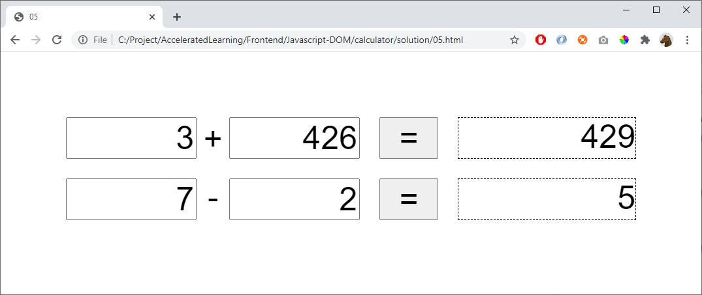

# 05 - Own Styling

Use CSS to create a more beautiful page:

You may use the following HTML:

    

        <input id="num1" type="text" />
        
+

        <input id="num2" type="text" />
        <button onclick="calculate('+', 'num1', 'num2','result')">=</button>
        

    

    

        <input id="num3" type="text" />
        
-

        <input id="num4" type="text" />
        <button onclick="calculate('-', 'num3', 'num4','result2')">=</button>
        

    

## Hint

Use grid or flexbox:
- https://www.w3schools.com/css/css_grid.asp
- https://www.w3schools.com/css/css3_flexbox.asp

Investigate these CSS-properties:

    margin
    padding
    border
    font-family
    font-size
    display
    grid-template-columns
    text-align