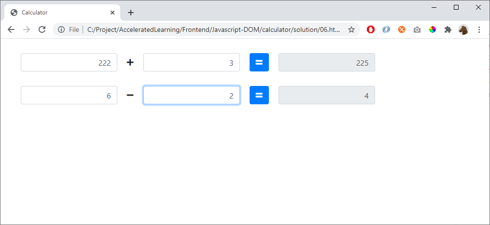

# 06 - Bootstrap styling

Remove your CSS-file

Use bootstrap for styling instead:

## Hint

Start with this template

    <!doctype html>
    <html lang="en">

    <head>
        <!-- Required meta tags -->
        <meta charset="utf-8">
        <meta name="viewport" content="width=device-width, initial-scale=1, shrink-to-fit=no">

        <!-- Bootstrap CSS -->
        <link rel="stylesheet" href="https://stackpath.bootstrapcdn.com/bootstrap/4.4.1/css/bootstrap.min.css"
            integrity="sha384-Vkoo8x4CGsO3+Hhxv8T/Q5PaXtkKtu6ug5TOeNV6gBiFeWPGFN9MuhOf23Q9Ifjh" crossorigin="anonymous">

        <title>Calculator</title>
    </head>

    <body>

        

            <h1>Hello calculator!</h1>
        

    </body>

    </html>

Documentation:

https://getbootstrap.com/docs/4.5/components/forms/

Checkout **Font Awesome** to create plus and minus signs (+ and -)

