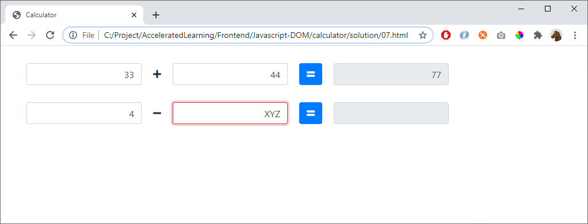

# 07 - Red border

Remove the alert-boxes

If the user enters an incorrect number in a text field, a red frame appears around the incorrect box. Check this on every keypress.

Remove all id's from the HTML so it's easier to add more calculators

## Tips

Use this HTML-code:  

    <form class="form-inline calc-row">
        <input type="text" class="form-control" onkeyup="validate(this)">                    
        
<i class="fas fa-plus"></i>

        <input type="text" class="form-control" onkeyup="validate(this)">
        <button onclick="calculate('+', this)" type="button" class="btn btn-primary"><i
                class="fas fa-equals"></i></button>
        <input type="text" class="form-control result" readonly>
    </form>

    <form class="form-inline calc-row">
        <input type="text" class="form-control" onkeyup="validate(this)">
        
<i class="fas fa-minus"></i>

        <input type="text" class="form-control" onkeyup="validate(this)">
        <button onclick="calculate('-', this)" type="button" class="btn btn-primary"><i
                class="fas fa-equals"></i></button>
        <input type="text" class="form-control result" readonly>
    </form>

Note the event **onkeyup** and

    onclick="calculate('-', this)"

