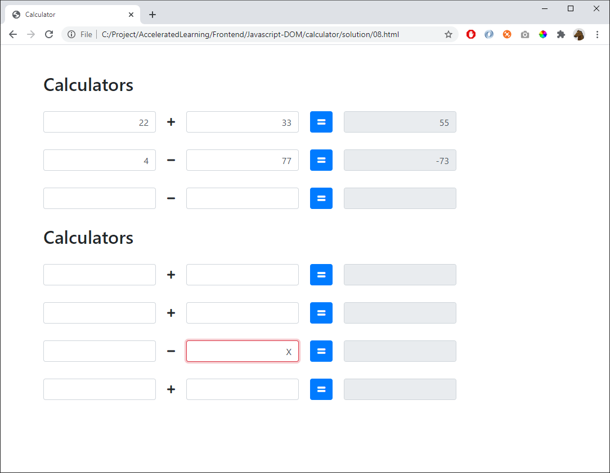

# 08 - Modular (extra)

This HTML:

    <body>

        

            <h2>Calculators</h2>
            

            

            <h2>Calculators</h2>
            

            

        

        
        
        

    </body>

...should give:

