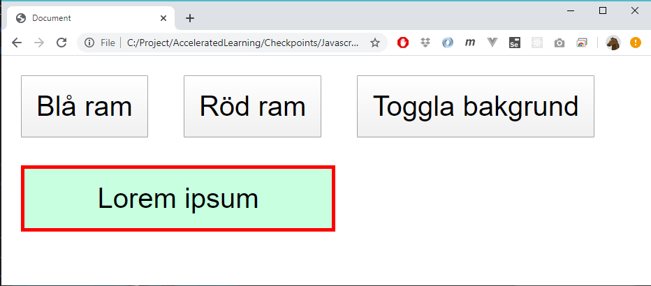
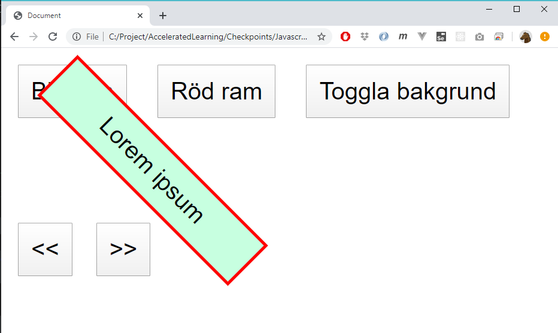

# Checkpoint 

Download startkit.zip and unpack into a folder.

You only need to do Level 1 to pass the checkpoint. Level 2 is optional. 

If you want to Level 2, then start with Level 1.

Only write code in index.js. You're **not allowed** to modify the HTML or CSS file.

## Time

2h

## Submission

For both levels, **only** submit the file **index.js**

## Level 1 

Create javascript-code so all three buttons work. 

"Blå ram" should set the color of the border to blue

"Röd ram" should set the color of the border to red

"Toggla bakgrund" should set the background color to a lime'ish color. Next time the button is pressed the background should be transparent. Etc.

Here the user have pressed "Blå ram", then "Röd ram" then "Toggla bakgrund":

Hint:

Read about "classList":

    xxxxx.classList.add("yyyy")
    xxxxx.classList.remove("yyyy")

## Level 2

First do Level 1.

Note that your not allowed to modify the HTML or CSS files.

Add two more buttons. One of the buttons should rotate *Lorem ipsum*-box clockwise 45 degrees each time. The other button should rotate counter-clockwise.

Hint:

Use the CSS-property *rotate*

