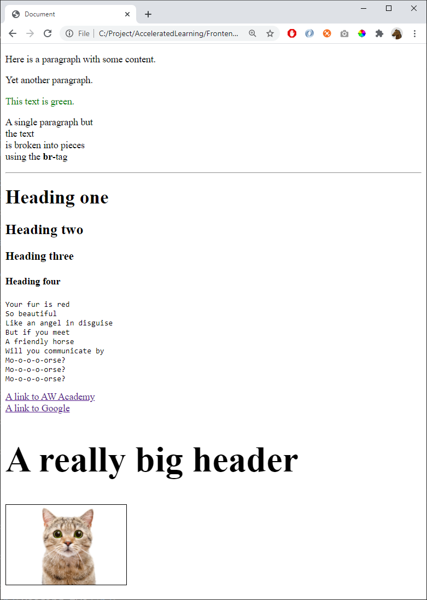

# 01 - Basics

References
- https://www.w3schools.com/html/html_basic.asp
- https://www.w3schools.com/html/html_elements.asp
- https://www.w3schools.com/html/html_attributes.asp
- https://www.w3schools.com/html/html_headings.asp
- https://www.w3schools.com/html/html_paragraphs.asp

Create the following HTML-page:

