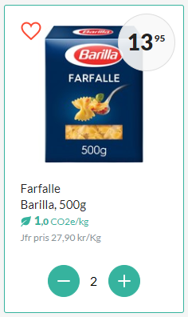

# Project - Frontend

## What

Techniques: HTML, CSS, Javascript

Make a **component**. Similar the calculator exercise.

The component should contain a couple of form elements such as
- date selector
- text boxes
- radiobuttons
- checkboxes
- buttons
- selectboxes
- textarea's

Create a HTML page where you use your **component** in two or more times.

Feel free to use **Bootstrap** or create your own CSS

Focus more on **Javascript** than CSS.

## Tips

Look for small graphic components in sites such as:

- mat.se
- hotels.com
- mtrx.travel
- facebook.com
- gmail.com

## Brainstorming

Start with brainstorming ideas. We share our ideas.

## Presentation

Present your project in 5 minutes:
- Demonstrates how your component works
- Why did you choose to do this?
- What have you learned?
- Show one detail from the code

# Ex1

# Ex2

# Ex3

# Ex4

# Ex5

# Ex6

# Ex7

# Ex8

# Ex9

