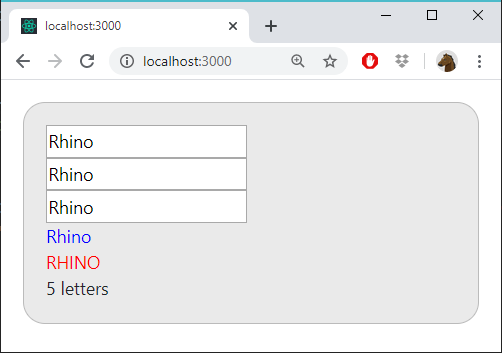

# Syncboxes 01

The user can write in any of the textboxes

All textboxes changes at the same time

The last texts:
- The text in blue
- The text in red and uppcase
- One letter, Two letters, 3 letters...etc

## R

## Rh

## Rhi

## Rhin

## Rhino
